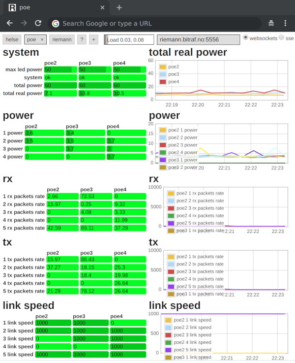

This program collects metrics from the web interface of [Zyxel GS1200][1] PoE switches, and submits them to [Riemann][2].
Collected metrics include
- power usage per port,
- number of packets received and transmitted per port,
- link status and speed per port,
- total power usage, and
- system information such as firmware version and mac address.

A [riemann-dash][3] dashboard fed by this program may look like this:



## How to run

```
pip3 install --user -r requirements.txt
cp example.ini my_configuration.ini
edit my_configuration.ini
./riemann-zyxel-gs1200.py my_configuration.ini
```

[1]: https://www.zyxel.com/products_services/5-Port-8-Port-Web-Managed-PoE-Gigabit-Switch-GS1200-5HP-v2-GS1200-8HP-v2/
[2]: http://riemann.io/
[3]: https://github.com/riemann/riemann-dash
[dash.png]: https://cdn.jsdelivr.net/gh/mastensg/riemann-zyxel-gs1200/dash.png
